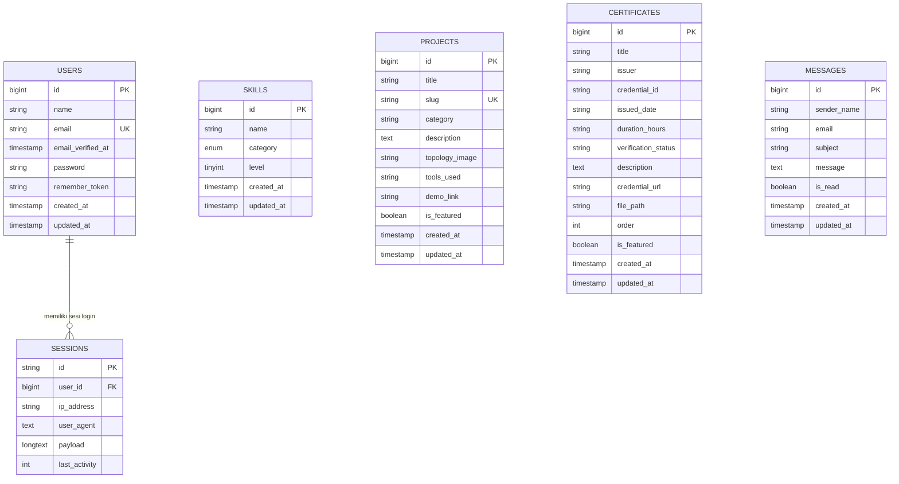

# Dokumentasi Lengkap Skema Database (Database Schema Guide)
**Proyek:** Web Portofolio & Server Siswa TKJ - I Made Yuda Pramana  
**Sistem Operasi & Database:** Debian GNU/Linux 13 (Trixie) & MariaDB 10.11 (Engine InnoDB)  
**Framework:** Laravel 11 (Eloquent ORM)

---

## 1. Pendahuluan & Arsitektur Database

Sistem database pada website portofolio ini dibangun di atas sistem manajemen basis data relasional (**RDBMS**) **MariaDB 10.11** dengan *storage engine* **InnoDB**. MariaDB dipilih karena memiliki keandalan tinggi, performa transaksi cepat, dan integritas data ACID (*Atomicity, Consistency, Isolation, Durability*).

Dalam framework Laravel 11, struktur tabel dikelola menggunakan mekanisme **Database Migration**. Migration bertindak seperti *version control system* untuk database, memungkinkan developer mendefinisikan, memodifikasi, dan mereproduksi skema tabel secara konsisten di lingkungan pengembangan maupun produksi.

### Standar Konvensi:
- **Nama Tabel:** Huruf kecil jamak (*plural snake_case*), contoh: `users`, `skills`, `projects`, `certificates`, `messages`.
- **Primary Key:** Standar menggunakan kolom `id` bertipe auto-incrementing unsigned big integer.
- **Timestamps:** Setiap tabel data menyertakan `created_at` dan `updated_at` untuk pencatatan audit perubahan data.
- **Charset & Collation:** `utf8mb4` dengan collation `utf8mb4_unicode_ci` untuk dukungan penuh karakter internasional dan simbol teknis.

---

## 2. Panduan Cara Membuat Skema Database di Laravel

Proses pembuatan skema database di Laravel mengikuti alur kerja terstruktur dari perintah terminal hingga eksekusi SQL otomatis.

### Langkah 1: Membuat File Migration via Artisan CLI

Untuk membuat skema baru, gunakan perintah Artisan bawaan Laravel pada terminal server:

```bash
# Membuat migration untuk tabel baru
php artisan make:migration create_skills_table
php artisan make:migration create_projects_table
php artisan make:migration create_certificates_table
php artisan make:migration create_messages_table

# Atau membuat migration sekaligus dengan Model dan Seeder
php artisan make:model Certificate -ms
```

Perintah di atas akan menghasilkan file baru di direktori `database/migrations/` dengan nama berformat stempel waktu, contoh: `2026_09_06_000001_create_skills_table.php`.

---

### Langkah 2: Mengonfigurasi Definisi Kolom pada File Migration

File migration terdiri atas dua metode utama:
- `up()`: Berisi instruksi pembuatan tabel, kolom, tipe data, dan indeks.
- `down()`: Berisi instruksi pembatalan (*rollback*) jika migration ditarik kembali.

Contoh implementasi nyata pada tabel `skills`:

```php
<?php

use Illuminate\Database\Migrations\Migration;
use Illuminate\Database\Schema\Blueprint;
use Illuminate\Support\Facades\Schema;

return new class extends Migration
{
    /**
     * Jalankan migration untuk membuat tabel.
     */
    public function up(): void
    {
        Schema::create('skills', function (Blueprint $table) {
            $table->id();                                                           // Primary Key (BIGINT Auto Increment)
            $table->string('name');                                                 // Nama keahlian (VARCHAR 255)
            $table->enum('category', ['networking', 'sysadmin', 'hardware', 'tools']) // ENUM kategori
                  ->default('networking');
            $table->unsignedTinyInteger('level')->default(80);                      // Tingkat penguasaan 1-100 (TINYINT)
            $table->timestamps();                                                   // created_at & updated_at (TIMESTAMP)
        });
    }

    /**
     * Batalkan migration jika dilakukan rollback.
     */
    public function down(): void
    {
        Schema::dropIfExists('skills');
    }
};
```

---

### Langkah 3: Referensi Tipe Data Blueprint Laravel yang Digunakan

| Method Blueprint Laravel | Tipe Data MariaDB / MySQL | Penggunaan dalam Proyek |
| :--- | :--- | :--- |
| `$table->id()` | `BIGINT UNSIGNED AUTO_INCREMENT PRIMARY KEY` | Kolom identitas unik setiap record |
| `$table->string('kolom', panjang)` | `VARCHAR(255)` atau sesuai panjang | Judul, nama, email, slug, credential ID |
| `$table->text('kolom')` | `TEXT` | Deskripsi panjang proyek, sertifikat, atau pesan |
| `$table->enum('kolom', [...])` | `ENUM(...)` | Kategori skill terstandar (*networking, sysadmin, dll*) |
| `$table->unsignedTinyInteger('kolom')`| `TINYINT UNSIGNED` (0 - 255) | Persentase nilai keahlian (0 - 100%) |
| `$table->unsignedInteger('kolom')` | `INT UNSIGNED` | Pengurutan tampilan data (*order sequence*) |
| `$table->boolean('kolom')` | `TINYINT(1)` | Flag status (`is_featured`, `is_read`) |
| `$table->timestamps()` | `TIMESTAMP NULL` (2 kolom) | Waktu data dibuat dan diperbarui |
| `$table->foreignId('user_id')` | `BIGINT UNSIGNED` (Foreign Key) | Relasi tabel pengguna ke tabel lain |

---

### Langkah 4: Menjalankan Perintah Eksekusi Migration

Setelah file migration selesai didefinisikan, terapkan perubahan skema ke database MariaDB menggunakan terminal:

```bash
# 1. Menjalankan migration yang belum dieksekusi
php artisan migrate

# 2. Memeriksa status migration (sudah jalan / belum)
php artisan migrate:status

# 3. Membatalkan (rollback) langkah migration terakhir
php artisan migrate:rollback

# 4. Mereset dan menjalankan ulang seluruh migration dari nol + isi data awal (seeder)
php artisan migrate:fresh --seed
```

---

### Langkah 5: Mengisi Data Awal Database (*Database Seeder*)

Agar tabel langsung memiliki data siap pakai, buat seeder menggunakan Artisan:

```bash
php artisan make:seeder SkillSeeder
php artisan make:seeder CertificateSeeder
php artisan make:seeder ProjectSeeder
```

Contoh pengisian data di `database/seeders/SkillSeeder.php`:

```php
Skill::create([
    'name' => 'Cisco Routing & Switching (CCNA)',
    'category' => 'networking',
    'level' => 90
]);
```

Jalankan pengisian data dengan perintah:
```bash
php artisan db:seed
```

---

## 3. Diagram Relasi Entitas (Entity Relationship Diagram)

Berikut adalah visualisasi hubungan logis antara tabel pada database portofolio:



---

## 4. Hasil Skema Database dalam Bentuk Tabel

Berikut adalah spesifikasi lengkap seluruh tabel aplikasi beserta kolom, tipe data, atribut, dan contoh isi datanya:

### 4.1 Tabel `users` (Autentikasi Admin)
Menyimpan kredensial administrator untuk mengelola dashboard CRUD portofolio.

| Nama Kolom | Tipe Data | Nullable | Default | Indeks / Kunci | Keterangan |
| :--- | :--- | :---: | :---: | :---: | :--- |
| `id` | `BIGINT UNSIGNED` | Tidak | Auto Increment | Primary Key | ID unik admin |
| `name` | `VARCHAR(255)` | Tidak | - | - | Nama lengkap admin |
| `email` | `VARCHAR(255)` | Tidak | - | Unique | Alamat surel unik untuk login |
| `email_verified_at`| `TIMESTAMP` | Ya | `NULL` | - | Tanggal verifikasi surel |
| `password` | `VARCHAR(255)` | Tidak | - | - | Hash sandi bcrypt/argon2 |
| `remember_token` | `VARCHAR(100)` | Ya | `NULL` | - | Token autentikasi "Remember Me" |
| `created_at` | `TIMESTAMP` | Ya | `NULL` | - | Waktu akun didaftarkan |
| `updated_at` | `TIMESTAMP` | Ya | `NULL` | - | Waktu data akun terakhir diubah |

**Contoh Data Nyata (`users`):**
| id | name | email | password (Hash) | created_at |
| :-: | :--- | :--- | :--- | :--- |
| 1 | I Made Yuda Pramana | admin@yuda.local | `$2y$12$e...` | 2026-09-06 10:00:00 |

---

### 4.2 Tabel `skills` (Matriks Keahlian TKJ)
Menyimpan daftar kemampuan teknis di bidang jaringan, server, perangkat keras, dan utilitas.

| Nama Kolom | Tipe Data | Nullable | Default | Indeks / Kunci | Keterangan |
| :--- | :--- | :---: | :---: | :---: | :--- |
| `id` | `BIGINT UNSIGNED` | Tidak | Auto Increment | Primary Key | ID unik data skill |
| `name` | `VARCHAR(255)` | Tidak | - | - | Nama teknologi/keahlian |
| `category` | `ENUM('networking', 'sysadmin', 'hardware', 'tools')` | Tidak | `'networking'` | - | Klaster bidang keahlian |
| `level` | `TINYINT UNSIGNED` | Tidak | `80` | - | Penguasaan dalam persen (1-100) |
| `created_at` | `TIMESTAMP` | Ya | `NULL` | - | Waktu data ditambahkan |
| `updated_at` | `TIMESTAMP` | Ya | `NULL` | - | Waktu data diperbarui |

**Contoh Data Nyata (`skills`):**
| id | name | category | level | created_at |
| :-: | :--- | :--- | :-: | :--- |
| 1 | Cisco Routing & Switching | networking | 92 | 2026-09-06 10:00:00 |
| 2 | Linux Server Administration (Debian) | sysadmin | 88 | 2026-09-06 10:00:00 |
| 3 | Mikrotik MTCNA Essentials | networking | 85 | 2026-09-06 10:00:00 |
| 4 | Network Troubleshooting & Wireshark | tools | 90 | 2026-09-06 10:00:00 |

---

### 4.3 Tabel `projects` (Karya & Proyek Unggulan)
Menyimpan proyek yang dikembangkan, topologi jaringan, tautan demo, dan repositori kode.

| Nama Kolom | Tipe Data | Nullable | Default | Indeks / Kunci | Keterangan |
| :--- | :--- | :---: | :---: | :---: | :--- |
| `id` | `BIGINT UNSIGNED` | Tidak | Auto Increment | Primary Key | ID unik proyek |
| `title` | `VARCHAR(255)` | Tidak | - | - | Judul nama proyek |
| `slug` | `VARCHAR(255)` | Tidak | - | Unique | Slug URL ramah SEO |
| `category` | `VARCHAR(255)` | Tidak | `'Networking'` | - | Kategori proyek |
| `description` | `TEXT` | Tidak | - | - | Rincian lengkap deskripsi proyek |
| `topology_image` | `VARCHAR(255)` | Ya | `NULL` | - | Nama/path berkas gambar topologi |
| `tools_used` | `VARCHAR(255)` | Ya | `NULL` | - | Daftar alat/tools yang digunakan |
| `demo_link` | `VARCHAR(255)` | Ya | `NULL` | - | Tautan demo live atau repositori GitHub |
| `is_featured` | `TINYINT(1)` | Tidak | `0` (false) | - | Penanda tampil di halaman utama |
| `created_at` | `TIMESTAMP` | Ya | `NULL` | - | Waktu proyek didaftarkan |
| `updated_at` | `TIMESTAMP` | Ya | `NULL` | - | Waktu data proyek diperbarui |

**Contoh Data Nyata (`projects`):**
| id | title | slug | category | tools_used | is_featured |
| 1 | IT Toolbox v1.5.0 Engineering Workbench | `it-toolbox` | Network & Tools | Go 1.25+, Fyne v2.8, SQLite, Cisco CLI, Schema DDL | 1 |
| 2 | SakuKu Financial & Multiaset Portfolio | `sakuku` | Financial Tech & Mobile | Flutter, Dart 3.x, SQLite, Neumorphism | 1 |
| 3 | VisualStyle Studio CSS Workbench (Beta) | `visualstyle-studio` | Frontend & Desktop Tools | Electron, Node.js, JS (ES6+), CSS3 Keyframes | 1 |

---

### 4.4 Tabel `certificates` (Sertifikasi Kompetensi Resmi)
Menyimpan bukti sertifikat resmi (Cisco Networking Academy, Komdigi/BSSN, dll).

| Nama Kolom | Tipe Data | Nullable | Default | Indeks / Kunci | Keterangan |
| :--- | :--- | :---: | :---: | :---: | :--- |
| `id` | `BIGINT UNSIGNED` | Tidak | Auto Increment | Primary Key | ID unik sertifikat |
| `title` | `VARCHAR(255)` | Tidak | - | - | Nama resmi sertifikat kompetensi |
| `issuer` | `VARCHAR(255)` | Tidak | - | - | Lembaga/organisasi penerbit sertifikat |
| `credential_id` | `VARCHAR(255)` | Ya | `NULL` | - | Nomor seri ID verifikasi sertifikat |
| `issued_date` | `VARCHAR(255)` | Ya | `NULL` | - | Tanggal/bulan penerbitan sertifikat |
| `duration_hours` | `VARCHAR(255)` | Ya | `NULL` | - | Total jam pelatihan (*hours of study*) |
| `verification_status` | `VARCHAR(255)` | Ya | `'BSrE BSSN Valid'` | - | Status keabsahan tanda tangan elektronik |
| `description` | `TEXT` | Ya | `NULL` | - | Cakupan materi uji kompetensi |
| `credential_url` | `VARCHAR(255)` | Ya | `NULL` | - | Tautan verifikasi sertifikat online |
| `file_path` | `VARCHAR(255)` | Ya | `NULL` | - | Lokasi penyimpanan berkas sertifikat PDF |
| `order` | `INT UNSIGNED` | Tidak | `0` | - | Urutan tampil sertifikat pada antarmuka |
| `is_featured` | `TINYINT(1)` | Tidak | `1` (true) | - | Penanda prioritas sertifikat unggulan |
| `created_at` | `TIMESTAMP` | Ya | `NULL` | - | Waktu data disimpan |
| `updated_at` | `TIMESTAMP` | Ya | `NULL` | - | Waktu data diperbarui |

**Contoh Data Nyata (`certificates`):**
| id | title | issuer | credential_id | issued_date | verification_status |
| :-: | :--- | :--- | :--- | :--- | :--- |
| 1 | Networking Devices and Initial Configuration | Cisco NetAcad | `cisco-net-dev-2026` | 2026 | Verified by Cisco |
| 2 | Networking Basics | Cisco NetAcad | `cisco-net-basic-2026` | 2026 | Verified by Cisco |
| 3 | Pelatihan Pemasangan Kabel Fiber Optik | Komdigi | `komdigi-fo-001` | 2026 | BSrE BSSN Valid |

---

### 4.5 Tabel `messages` (Inbox Pesan Kontak)
Menampung formulir kontak dari pengunjung website ke admin portofolio.

| Nama Kolom | Tipe Data | Nullable | Default | Indeks / Kunci | Keterangan |
| :--- | :--- | :---: | :---: | :---: | :--- |
| `id` | `BIGINT UNSIGNED` | Tidak | Auto Increment | Primary Key | ID unik pesan |
| `sender_name` | `VARCHAR(255)` | Tidak | - | - | Nama lengkap pengirim |
| `email` | `VARCHAR(255)` | Tidak | - | - | Alamat surel pengirim pesan |
| `subject` | `VARCHAR(255)` | Tidak | - | - | Perihal topik pesan |
| `message` | `TEXT` | Tidak | - | - | Isi lengkap pesan |
| `is_read` | `TINYINT(1)` | Tidak | `0` (false) | - | Status sudah dibaca oleh admin |
| `created_at` | `TIMESTAMP` | Ya | `NULL` | - | Waktu pesan dikirimkan |
| `updated_at` | `TIMESTAMP` | Ya | `NULL` | - | Waktu pembaruan status pesan |

---

### 4.6 Tabel Pendukung Sistem Laravel

Berikut tabel bawaan framework Laravel 11 yang bertugas mengelola sesi, cache, dan antrean tugas:

#### Tabel `sessions` (Manajemen Sesi Pengguna)
| Nama Kolom | Tipe Data | Keterangan |
| :--- | :--- | :--- |
| `id` | `VARCHAR(255) PRIMARY KEY` | Session ID unik terenkripsi |
| `user_id` | `BIGINT UNSIGNED NULL INDEX` | ID user pemilik sesi (jika login) |
| `ip_address` | `VARCHAR(45) NULL` | Alamat IPv4 atau IPv6 pengunjung |
| `user_agent` | `TEXT NULL` | Informasi web browser dan sistem operasi |
| `payload` | `LONGTEXT` | Data sesi terenkripsi |
| `last_activity` | `INT INDEX` | Unix timestamp aktivitas terakhir |

#### Tabel `cache` & `cache_locks` (Performa Kueri Caching)
| Tabel | Kolom | Tipe Data | Keterangan |
| :--- | :--- | :--- | :--- |
| `cache` | `key` | `VARCHAR(255) PRIMARY KEY` | Kata kunci penyimpanan cache |
| `cache` | `value` | `MEDIUMTEXT` | Nilai data yang disimpan |
| `cache` | `expiration` | `INT` | Waktu kedaluwarsa cache |
| `cache_locks` | `key` | `VARCHAR(255) PRIMARY KEY` | Kunci proteksi konkurensi data |
| `cache_locks` | `owner` | `VARCHAR(255)` | Pemilik proses lock |
| `cache_locks` | `expiration` | `INT` | Batas waktu kadaluwarsa lock |

---

## 5. Ringkasan Perintah Manajemen Database

Berikut ringkasan perintah harian untuk mengelola skema dan data database:

```bash
# Cek konektivitas dan status database
php artisan db:show

# Buka interaktif CLI database MariaDB langsung dari project
php artisan db

# Jalankan seeder tertentu
php artisan db:seed --class=CertificateSeeder

# Eksekusi kueri Eloquent lewat terminal Tinker
php artisan tinker --execute="dump(App\Models\Certificate::count());"
```
