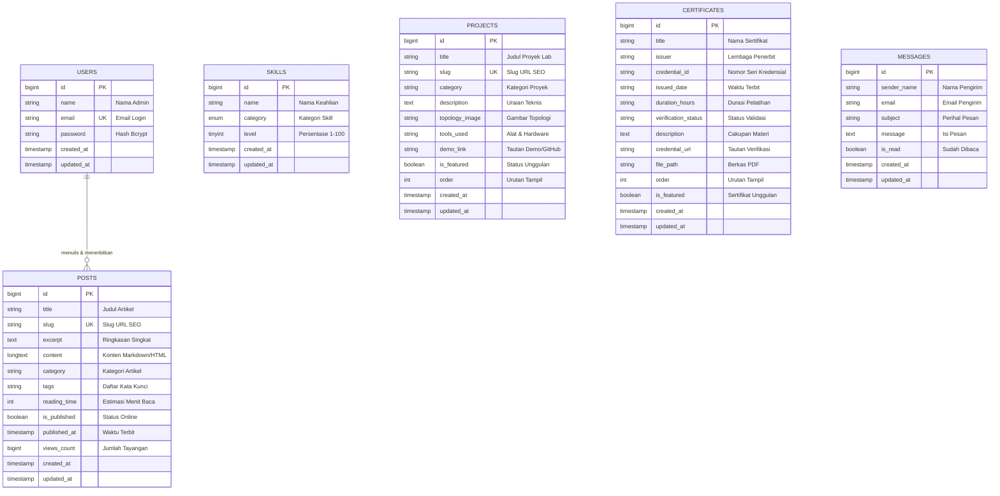

# Panduan & Dokumentasi Skema Database (Database Schema Guide)

Dokumentasi arsitektur basis data, kamus data relasional, dan panduan migrasi untuk website portofolio serta server **I Made Yuda Pramana**.

---

## 1. Informasi Sistem & Standar Arsitektur

| Parameter | Spesifikasi | Keterangan |
| :--- | :--- | :--- |
| **Sistem Operasi** | Debian GNU/Linux 13 (Trixie) | Server baremetal LEMP Stack |
| **RDBMS Server** | MariaDB 11.8 / 10.11 | Storage Engine: InnoDB (Mendukung transaksi ACID) |
| **Framework Web** | Laravel 11.x | Object-Relational Mapping (Eloquent ORM) |
| **Karakter Set** | `utf8mb4` | Dukungan simbol unicode, emoji, dan karakter teknis |
| **Collation** | `utf8mb4_unicode_ci` | Pengurutan dan pencarian tanpa membedakan huruf besar/kecil |
| **Koneksi Default** | Soket UNIX lokal / TCP 3306 | Akses database terisolasi lokal demi keamanan |

### Konvensi Standar:
- **Nama Tabel:** Menggunakan huruf kecil jamak (*plural snake_case*), seperti `users`, `skills`, `projects`, `certificates`, `posts`, dan `messages`.
- **Kunci Utama (Primary Key):** Kolom `id` bertipe `BIGINT UNSIGNED AUTO_INCREMENT`.
- **Audit Jejak Waktu (Timestamps):** Kolom `created_at` dan `updated_at` bertipe `TIMESTAMP` nullable pada setiap tabel aplikasi.
- **Integritas Referensial:** Menjamin konsistensi data menggunakan constraint foreign key dan indeks pada kolom relasi serta pencarian.

---

## 2. Diagram Relasi Entitas (Entity Relationship Diagram)

Berikut visualisasi hubungan logis antartabel di dalam sistem database:



---

## 3. Kamus Data & Rincian Struktur Tabel

### 3.1 Tabel `users` (Otentikasi & Akun Administrator)
Menyimpan kredensial akun pengelola portofolio untuk mengakses panel admin.

| Kolom | Tipe Data | Null | Default | Atribut / Kunci | Keterangan |
| :--- | :--- | :---: | :---: | :---: | :--- |
| `id` | `BIGINT UNSIGNED` | Tidak | Auto Increment | **PRIMARY KEY** | ID unik administrator |
| `name` | `VARCHAR(255)` | Tidak | - | - | Nama lengkap admin |
| `email` | `VARCHAR(255)` | Tidak | - | **UNIQUE INDEX** | Alamat email unik untuk login |
| `email_verified_at` | `TIMESTAMP` | Ya | `NULL` | - | Waktu verifikasi surel |
| `password` | `VARCHAR(255)` | Tidak | - | - | Hash sandi Bcrypt terenkripsi |
| `remember_token` | `VARCHAR(100)` | Ya | `NULL` | - | Token sesi mengingat login |
| `created_at` | `TIMESTAMP` | Ya | `NULL` | - | Waktu akun dibuat |
| `updated_at` | `TIMESTAMP` | Ya | `NULL` | - | Waktu pembaruan akun |

---

### 3.2 Tabel `skills` (Matriks Keahlian & Standar Kompetensi)
Menyimpan daftar kemampuan teknis siswa TKJ yang ditampilkan pada beranda website.

| Kolom | Tipe Data | Null | Default | Atribut / Kunci | Keterangan |
| :--- | :--- | :---: | :---: | :---: | :--- |
| `id` | `BIGINT UNSIGNED` | Tidak | Auto Increment | **PRIMARY KEY** | ID unik keahlian |
| `name` | `VARCHAR(255)` | Tidak | - | - | Nama teknologi, protokol, atau keahlian |
| `category` | `ENUM(...)` | Tidak | `'networking'` | **INDEX** | Pilihan: `networking`, `sysadmin`, `hardware`, `tools` |
| `level` | `TINYINT UNSIGNED` | Tidak | `80` | - | Tingkat penguasaan teknis (rentang 1 sampai 100 persen) |
| `created_at` | `TIMESTAMP` | Ya | `NULL` | - | Waktu data disimpan |
| `updated_at` | `TIMESTAMP` | Ya | `NULL` | - | Waktu data diperbarui |

**Contoh Rekaman Data:**
- `id: 1` | `name: Cisco Routing & Switching (CCNA)` | `category: networking` | `level: 90`
- `id: 2` | `name: Linux Server Administration (Debian)` | `category: sysadmin` | `level: 88`
- `id: 3` | `name: Fiber Optik & Fusion Splicing` | `category: hardware` | `level: 85`

---

### 3.3 Tabel `projects` (Dokumentasi Lab & Proyek Rekayasa)
Menyimpan data pameran karya lab, topologi jaringan, dan perangkat lunak yang dibangun.

| Kolom | Tipe Data | Null | Default | Atribut / Kunci | Keterangan |
| :--- | :--- | :---: | :---: | :---: | :--- |
| `id` | `BIGINT UNSIGNED` | Tidak | Auto Increment | **PRIMARY KEY** | ID unik proyek lab |
| `title` | `VARCHAR(255)` | Tidak | - | - | Judul lengkap proyek lab |
| `slug` | `VARCHAR(255)` | Tidak | - | **UNIQUE INDEX** | Slug URL untuk routing detail proyek |
| `category` | `VARCHAR(100)` | Tidak | `'Networking'` | **INDEX** | Bidang proyek (misal: *Financial Tech*, *Network & Tools*) |
| `description` | `TEXT` | Tidak | - | - | Uraian lengkap langkah kerja, topologi, dan metode |
| `topology_image` | `VARCHAR(255)` | Ya | `NULL` | - | Nama atau path berkas gambar topologi di storage |
| `tools_used` | `VARCHAR(255)` | Ya | `NULL` | - | Daftar alat atau teknologi dipisahkan koma |
| `demo_link` | `VARCHAR(255)` | Ya | `NULL` | - | Tautan repositori GitHub atau live demo |
| `is_featured` | `TINYINT(1)` | Tidak | `0` (false) | **INDEX** | Penanda proyek tampil di kartu utama beranda |
| `order` | `INT UNSIGNED` | Tidak | `0` | **INDEX** | Urutan prioritas penayangan |
| `created_at` | `TIMESTAMP` | Ya | `NULL` | - | Waktu proyek didokumentasikan |
| `updated_at` | `TIMESTAMP` | Ya | `NULL` | - | Waktu dokumentasi disunting |

**Contoh Rekaman Data:**
- `IT Toolbox v1.5.0` (`it-toolbox`): Go, Fyne v2.8, SQLite, Cisco CLI
- `SakuKu Financial Tech` (`sakuku`): Flutter, Dart, SQLite, Neumorphic UI
- `VisualStyle Studio CSS Workbench` (`visualstyle-studio`): Electron, JS ES6+, CSS3 Keyframes

---

### 3.4 Tabel `posts` (Jurnal Rekayasa & Artikel Blog Pribadi)
Menyimpan tulisan teknis, RFC konfigurasi server Debian, dan artikel eksplorasi jaringan.

| Kolom | Tipe Data | Null | Default | Atribut / Kunci | Keterangan |
| :--- | :--- | :---: | :---: | :---: | :--- |
| `id` | `BIGINT UNSIGNED` | Tidak | Auto Increment | **PRIMARY KEY** | ID unik artikel |
| `title` | `VARCHAR(255)` | Tidak | - | - | Judul artikel jurnal |
| `slug` | `VARCHAR(255)` | Tidak | - | **UNIQUE INDEX** | Slug URL ramah mesin pencari |
| `excerpt` | `TEXT` | Ya | `NULL` | - | Ringkasan pembuka untuk kartu katalog |
| `content` | `LONGTEXT` | Tidak | - | - | Isi lengkap artikel dalam format Markdown atau HTML |
| `category` | `VARCHAR(100)` | Tidak | `'Linux & Sysadmin'` | **INDEX** | Kategori topik artikel |
| `tags` | `VARCHAR(255)` | Ya | `NULL` | - | Kata kunci teknis dipisahkan koma |
| `reading_time` | `INT UNSIGNED` | Tidak | `5` | - | Estimasi durasi membaca dalam menit |
| `is_published` | `TINYINT(1)` | Tidak | `1` (true) | **INDEX** | Penanda visibilitas publik pada rute `/blog` |
| `published_at` | `TIMESTAMP` | Ya | `NULL` | **INDEX** | Waktu perilisan resmi tulisan |
| `views_count` | `BIGINT UNSIGNED` | Tidak | `0` | - | Akumulasi pembaca yang membaca artikel |
| `created_at` | `TIMESTAMP` | Ya | `NULL` | - | Waktu draf artikel dibuat |
| `updated_at` | `TIMESTAMP` | Ya | `NULL` | - | Waktu artikel disunting |

**Contoh Rekaman Data:**
- `Optimasi Kernel Linux & TCP BBR`: Tuning sysctl socket TCP baremetal Debian 13
- `Implementasi RPKI & Validasi ROA`: Kriptografi route validation pada BGP border router
- `Arsitektur LEMP Baremetal`: Optimalisasi Nginx unix domain socket dan PHP-FPM worker pool

---

### 3.5 Tabel `certificates` (Sertifikasi Kompetensi Resmi)
Menyimpan bukti sertifikat resmi berstandar industri internasional dan nasional.

| Kolom | Tipe Data | Null | Default | Atribut / Kunci | Keterangan |
| :--- | :--- | :---: | :---: | :---: | :--- |
| `id` | `BIGINT UNSIGNED` | Tidak | Auto Increment | **PRIMARY KEY** | ID unik sertifikat |
| `title` | `VARCHAR(255)` | Tidak | - | - | Nama resmi sertifikat kompetensi |
| `issuer` | `VARCHAR(255)` | Tidak | - | - | Lembaga atau vendor penerbit (Cisco, Komdigi, dll) |
| `credential_id` | `VARCHAR(255)` | Ya | `NULL` | - | Nomor seri ID verifikasi sertifikat |
| `issued_date` | `VARCHAR(255)` | Ya | `NULL` | - | Tanggal atau tahun penerbitan |
| `duration_hours` | `VARCHAR(255)` | Ya | `NULL` | - | Total jam pelatihan (*hours of study*) |
| `verification_status` | `VARCHAR(255)` | Ya | `'Valid'` | - | Status keabsahan tanda tangan elektronik |
| `description` | `TEXT` | Ya | `NULL` | - | Rincian materi uji kompetensi |
| `credential_url` | `VARCHAR(255)` | Ya | `NULL` | - | Tautan verifikasi sertifikat online |
| `file_path` | `VARCHAR(255)` | Ya | `NULL` | - | Lokasi penyimpanan berkas PDF pada storage |
| `order` | `INT UNSIGNED` | Tidak | `0` | - | Urutan tampil pada kartu sertifikat |
| `is_featured` | `TINYINT(1)` | Tidak | `1` (true) | **INDEX** | Penanda sertifikat tampil di prioritas utama |
| `created_at` | `TIMESTAMP` | Ya | `NULL` | - | Waktu data dicatat |
| `updated_at` | `TIMESTAMP` | Ya | `NULL` | - | Waktu data diperbarui |

---

### 3.6 Tabel `messages` (Inbox Pesan Kontak Pengunjung)
Menampung pengiriman pesan dari formulir kontak publik ke administrator.

| Kolom | Tipe Data | Null | Default | Atribut / Kunci | Keterangan |
| :--- | :--- | :---: | :---: | :---: | :--- |
| `id` | `BIGINT UNSIGNED` | Tidak | Auto Increment | **PRIMARY KEY** | ID unik pesan masuk |
| `sender_name` | `VARCHAR(255)` | Tidak | - | - | Nama lengkap pengirim pesan |
| `email` | `VARCHAR(255)` | Tidak | - | - | Alamat surel aktif pengirim |
| `subject` | `VARCHAR(255)` | Tidak | - | - | Topik atau perihal pesan |
| `message` | `TEXT` | Tidak | - | - | Isi lengkap uraian pesan |
| `is_read` | `TINYINT(1)` | Tidak | `0` (false) | **INDEX** | Penanda status apakah sudah dibaca admin |
| `created_at` | `TIMESTAMP` | Ya | `NULL` | - | Waktu pengiriman pesan |
| `updated_at` | `TIMESTAMP` | Ya | `NULL` | - | Waktu status pesan diperbarui |

---

### 3.7 Tabel Internal Infrastruktur Framework Laravel
Tabel penunjang bawaan framework Laravel 11 untuk mendukung manajemen sesi web, cache, dan antrean latar belakang:

1. **`sessions`:** Mengelola sesi pengguna aktif (`id`, `user_id`, `ip_address`, `user_agent`, `payload`, `last_activity`).
2. **`cache` & `cache_locks`:** Penyimpanan kueri berkecepatan tinggi dan pencegahan *race conditions* data.
3. **`jobs` & `failed_jobs`:** Manajemen antrean tugas asinkronus (misal pengiriman notifikasi email).

---

## 4. Panduan Siklus Hidup Migrasi & Data Seeder

### Pemetaan Tipe Kolom Blueprint ke Tipe Kolom MariaDB

| Kode Blueprint Laravel | Tipe Data di MariaDB | Contoh Penggunaan |
| :--- | :--- | :--- |
| `$table->id()` | `BIGINT UNSIGNED AUTO_INCREMENT PRIMARY KEY` | Kunci utama unik setiap tabel |
| `$table->string('kolom', 255)` | `VARCHAR(255)` | Judul, slug, email, penerbit |
| `$table->text('kolom')` | `TEXT` | Deskripsi proyek, isi pesan |
| `$table->longText('kolom')` | `LONGTEXT` | Konten artikel panjang, kode, gambar base64 |
| `$table->enum('kolom', [...])` | `ENUM(...)` | Kategori keahlian terbatas terstandar |
| `$table->unsignedTinyInteger('kolom')` | `TINYINT UNSIGNED` | Persentase penguasaan keahlian (0-100) |
| `$table->unsignedInteger('kolom')` | `INT UNSIGNED` | Angka urutan tampilan, durasi baca |
| `$table->boolean('kolom')` | `TINYINT(1)` | Flag status aktif (`is_published`, `is_read`) |
| `$table->timestamps()` | `TIMESTAMP NULL` (2 kolom) | Otomatis mengisi `created_at` dan `updated_at` |

---

## 5. Lembar Sontekan Perintah Artisan Database

Jalankan perintah berikut di direktori root proyek (`/var/www/project_tkj_yuda2`):

```bash
# 1. Menampilkan status skema dan koneksi database saat ini
php artisan db:show

# 2. Menjalankan seluruh migrasi yang belum dieksekusi
php artisan migrate

# 3. Memeriksa daftar status setiap file migrasi
php artisan migrate:status

# 4. Menjalankan seeder untuk mengisi data awal
php artisan db:seed

# 5. Mereset database dari nol dan menjalankan seluruh seeder (Khusus Lab/Dev)
php artisan migrate:fresh --seed

# 6. Membuka terminal interaktif Eloquent ORM (Tinker)
php artisan tinker --execute="echo App\Models\Post::published()->count();"
```

---

*Dokumentasi ini dipelihara secara berkala untuk mencerminkan skema database aktif pada server produksi portofolio.*
