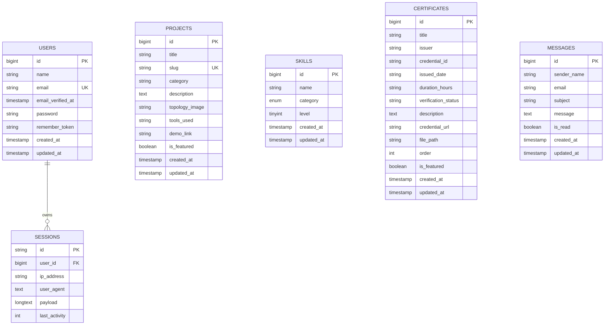

# Dokumentasi Teknis Sistem Web Portofolio & Lab TKJ
**I Made Yuda Pramana | SMKN 1 Denpasar**

Dokumen ini merupakan panduan arsitektur dan referensi teknis komprehensif untuk aplikasi web portofolio teknik komputer dan jaringan (TKJ). Dokumen ini mencakup struktur direktori, skema database, arsitektur backend dan frontend, konfigurasi server LEMP, telemetri sistem, serta panduan operasional.

---

## DAFTAR ISI

1. [Ikhtisar Proyek & Spesifikasi Lingkungan](#1-ikhtisar-proyek--spesifikasi-lingkungan)
2. [Anatomi & Struktur Direktori Proyek](#2-anatomi--struktur-direktori-proyek)
3. [Skema & Arsitektur Database](#3-skema--arsitektur-database)
4. [Arsitektur Backend (Laravel 12 / PHP 8.4)](#4-arsitektur-backend-laravel-12--php-84)
5. [Arsitektur Frontend (Discord Neon Theme & 3D Interactive)](#5-arsitektur-frontend-discord-neon-theme--3d-interactive)
6. [Layanan Khusus & Telemetri Server Linux](#6-layanan-khusus--telemetri-server-linux)
7. [Spesifikasi Web Server & Deployment LEMP Stack](#7-spesifikasi-web-server--deployment-lemp-stack)
8. [Panduan Operasional & Cheatsheet CLI](#8-panduan-operasional--cheatsheet-cli)

---

## 1. IKHTISAR PROYEK & SPESIFIKASI LINGKUNGAN

### 1.1 Deskripsi Aplikasi
Aplikasi ini adalah platform portofolio teknik dan showcase lab mandiri berstandar industri. Mengintegrasikan estetika visual Discord dark mode (Royal Blurple, neon glow, dan aset 3D) dengan ketangguhan backend Laravel enterprise dan pemantauan telemetri server Linux secara real-time.

### 1.2 Ringkasan Teknologi Utama (Tech Stack)

| Komponen | Spesifikasi / Paket | Deskripsi Peran |
|---|---|---|
| **Sistem Operasi** | Linux Debian 13 | Host sistem bare metal atau VM portofolio |
| **Web Server** | Nginx 1.22+ (Reverse Proxy & FastCGI) | Web server berkinerja tinggi penangan HTTP/HTTPS |
| **PHP Runtime** | PHP 8.4-FPM (`php8.4-fpm.sock`) | Engine pemroses logika server-side Laravel |
| **Framework Backend** | Laravel Framework 12 (PHP ^8.3) | Framework MVC, routing, ORM Eloquent, middleware |
| **Database Engine** | MariaDB 11.8.6 / MySQL 8.0 | RDBMS relasional penyimpan data persisten |
| **Build Tooling** | Vite 8 + @tailwindcss/vite | Bundler aset modern kompilasi kilat (<500ms) |
| **Framework CSS** | Tailwind CSS v4.0.0 | Sistem utilitas CSS modern, `@theme` token Discord |
| **Animasi & Interaksi** | GSAP 3.15, Swiper 14.2, Three.js 0.186 | Mesin animasi maskot otonom, carousel 3D, kanvas 3D |
| **Pengujian Otomatis** | PHPUnit 12.5, Laravel Pint 1.27 | Pengujian fitur, otentikasi, dan linter PSR-12 |

---

## 2. ANATOMI & STRUKTUR DIREKTORI PROYEK

Struktur hierarki proyek dianalisis dari direktori root `/var/www/project_tkj_yuda2/`:

```
/var/www/project_tkj_yuda2/
├── app/                        # Inti logika backend aplikasi (MVC)
│   ├── Http/
│   │   └── Controllers/        # Controller publik, auth, dan admin panel
│   │       ├── Admin/          # Controller CRUD panel manajemen admin
│   │       ├── AuthController.php
│   │       ├── Controller.php
│   │       └── PublicController.php
│   ├── Models/                 # Model Eloquent (User, Project, Skill, dll)
│   ├── Providers/              # Service Provider (AppServiceProvider)
│   └── Services/               # Layanan bisnis khusus (ServerMonitorService)
├── bootstrap/                  # Inisialisasi kernel framework dan cache boot
│   ├── app.php                 # Konfigurasi middleware dan routing Laravel 12
│   └── providers.php           # Registrasi service providers
├── config/                     # Berkas konfigurasi bawaan framework
│   ├── app.php                 # Identitas aplikasi, zona waktu, locale
│   ├── auth.php                # Guard dan provider otentikasi user
│   ├── cache.php               # Konfigurasi caching sistem
│   ├── database.php            # Koneksi MySQL/MariaDB dan SQLite
│   ├── filesystems.php         # Disk penyimpanan berkas publik/lokal
│   └── session.php             # Konfigurasi driver session database
├── database/                   # Manajemen skema dan data database
│   ├── factories/              # Factory pembuat data pengujian otomatis
│   ├── migrations/             # Skema DDL tabel database
│   └── seeders/                # Pengisi data awal administratif dan demonstrasi
├── design-system/              # Referensi tokens warna dan panduan desain
├── docs/                       # Dokumentasi arsitektur dan aset visual check
├── nginx/                      # Konfigurasi virtual host server block Nginx
│   └── project_tkj_yuda2.conf  # Server block production untuk yuda.local
├── public/                     # Dokumen publik root web server (docroot)
│   ├── index.php               # Front controller pintu masuk request Nginx
│   ├── build/                  # Asset CSS, JS, dan Font hasil kompilasi Vite
│   ├── certificates/           # Berkas PDF asli dan gambar sertifikasi
│   ├── images/                 # Seluruh aset visual (maskot, logo, diagram)
│   │   ├── discord_assets/     # Objek render 3D (laptop, kabel LAN, switch)
│   │   ├── discord_mascots/    # Karakter maskot (Clyde, Wumpus, Cyber Drone)
│   │   ├── orrery/             # Orb 3D planet stack teknologi
│   │   ├── tech_logos/         # Ikon vektor perangkat lunak
│   │   └── topologies/         # Diagram topologi jaringan dan arsitektur
│   └── robots.txt & favicon    # Berkas utilitas browser dan SEO
├── resources/                  # Berkas sumber daya mentah frontend
│   ├── css/
│   │   └── app.css             # Entri utama CSS, styling Tailwind v4 & Discord
│   ├── js/
│   │   ├── app.js              # Entri utama eksekusi modul JavaScript
│   │   ├── discord-mascots.js  # Mesin maskot otonom, patroli acak & smart bubble
│   │   ├── gsap-animations.js  # Kontroler animasi scroll dan entrance
│   │   ├── interactive-bg.js   # Kanvas interaktif taburan bintang berlian 4-sudut
│   │   └── orrery-gallery.js   # Galeri carousel 3D interaktif
│   └── views/                  # Template Blade tampilan antarmuka
│       ├── admin/              # Tampilan CRUD dashboard pengelolaan
│       ├── auth/               # Form login otentikasi administrator
│       ├── components/         # Komponen Blade reusable
│       ├── layouts/            # Layout induk publik (app) dan admin
│       ├── projects/           # Halaman katalog proyek dan halaman detail
│       └── home.blade.php      # Halaman utama landing page portofolio
├── routes/                     # Definisi rute URL aplikasi
│   ├── web.php                 # Rute web publik, login, dan panel admin
│   └── console.php             # Rute penjadwalan dan command line artisan
├── scripts/                    # Skrip bantu Python & Node.js
│   ├── generate_hardware_assets.py # Generator aset grafis 3D hardware
│   └── verify_robot_wander.js  # Penguji otomatis visual gerak maskot
├── storage/                    # Penyimpanan internal, log, dan sesi framework
│   ├── app/                    # Berkas file storage aplikasi
│   ├── framework/              # Cache view, cache data, dan sessions
│   └── logs/                   # Berkas pencatatan error (laravel.log)
├── tests/                      # Suite pengujian otomatis berbasis PHPUnit
│   ├── Feature/                # Pengujian alur fungsional (TkjPortfolioTest)
│   └── Unit/                   # Pengujian unit kelas individu
├── .env                        # Variabel lingkungan aktif
├── .env.example                # Template variabel lingkungan
├── artisan                     # CLI binary executable Laravel
├── composer.json & lock        # Manajemen dependensi paket PHP
├── package.json & lock         # Manajemen dependensi modul Node.js
├── phpunit.xml                 # Konfigurasi suite tes PHPUnit
├── setup-dns.sh                # Skrip bash konfigurasi otomatis DNS lokal
├── setup-lemp.sh               # Skrip bash otomatisasi instalasi stack LEMP
└── vite.config.js              # Konfigurasi bundler Vite
```

---

## 3. SKEMA & ARSITEKTUR DATABASE

Aplikasi menggunakan database relasional MariaDB/MySQL dengan nama database `project_tkj_yuda2`. Tabel dikonfigurasi dengan standar charset `utf8mb4` dan collation `utf8mb4_unicode_ci`.

### 3.1 Entity Relationship Diagram (ERD)



### 3.2 Spesifikasi Struktur Tabel

#### 1. Tabel `users`
Menyimpan akun administrator terverifikasi untuk mengelola konten dan membaca pesan masuk.
* `id`: BIGINT UNSIGNED, Primary Key, Auto Increment.
* `name`: VARCHAR(255), Nama lengkap admin (contoh: *I Made Yuda Pramana*).
* `email`: VARCHAR(255), Alamat email unik (*unique index*).
* `email_verified_at`: TIMESTAMP, Nullable, Waktu verifikasi akun.
* `password`: VARCHAR(255), Hash password aman berbasis algoritma Bcrypt.
* `remember_token`: VARCHAR(100), Nullable, Token sesi login berkelanjutan.
* `created_at`, `updated_at`: TIMESTAMP, Pencatat waktu pembuatan dan pembaruan.

#### 2. Tabel `projects`
Menyimpan seluruh data lab jaringan, implementasi sistem, dan karya teknologi.
* `id`: BIGINT UNSIGNED, Primary Key, Auto Increment.
* `title`: VARCHAR(255), Judul proyek atau nama lab praktikum.
* `slug`: VARCHAR(255), Identifier unik ramah SEO untuk URL (`/projects/{slug}`).
* `category`: VARCHAR(255), Kategori proyek (contoh: *Network & Tools*, *Sysadmin*, *Virtualization*).
* `description`: TEXT, Deskripsi teknis lengkap, modul aplikasi, dan dokumentasi arsitektur.
* `topology_image`: VARCHAR(255), Nullable, Path relatif berkas gambar topologi atau tangkapan layar.
* `tools_used`: VARCHAR(255), Nullable, Daftar perangkat, OS, atau bahasa yang digunakan.
* `demo_link`: VARCHAR(255), Nullable, URL repositori GitHub atau live demo proyek.
* `is_featured`: BOOLEAN, Default: `false`. Penanda proyek unggulan di landing page utama.
* `created_at`, `updated_at`: TIMESTAMP.

#### 3. Tabel `skills`
Menyimpan matriks keahlian teknis berdasarkan kategori spesialisasi TKJ.
* `id`: BIGINT UNSIGNED, Primary Key, Auto Increment.
* `name`: VARCHAR(255), Nama teknologi, protokol, atau keahlian (contoh: *Cisco OSPF & VLAN*, *Debian Linux LEMP*).
* `category`: ENUM(`networking`, `sysadmin`, `hardware`, `tools`), Default: `networking`.
* `level`: UNSIGNED TINYINT, Nilai kemahiran dengan rentang 1 hingga 100.
* `created_at`, `updated_at`: TIMESTAMP.

#### 4. Tabel `certificates`
Menyimpan kredensial sertifikasi resmi dari Cisco Networking Academy dan BLSDM Komdigi RI.
* `id`: BIGINT UNSIGNED, Primary Key, Auto Increment.
* `title`: VARCHAR(255), Nama sertifikasi resmi.
* `issuer`: VARCHAR(255), Lembaga penerbit (contoh: *Cisco Networking Academy*, *BLSDM Komdigi Yogyakarta*).
* `credential_id`: VARCHAR(255), Nullable, Nomor sertifikat atau ID verifikasi unik.
* `issued_date`: VARCHAR(255), Nullable, Tanggal terbit sertifikat.
* `duration_hours`: VARCHAR(255), Nullable, Bobot jam pelajaran (JP) atau level kompetensi.
* `verification_status`: VARCHAR(255), Status validasi (contoh: *TTE Elektronik BSrE BSSN Valid*).
* `description`: TEXT, Nullable, Rincian silabus kompetensi yang diuji.
* `credential_url`: VARCHAR(255), Nullable, Tautan verifikasi sertifikat eksternal.
* `file_path`: VARCHAR(255), Nullable, Path berkas PDF asli sertifikat di direktori public.
* `order`: UNSIGNED INT, Default: `0`. Urutan tampilan dalam carousel 3D sertifikasi.
* `is_featured`: BOOLEAN, Default: `true`. Ditampilkan pada showcase beranda.
* `created_at`, `updated_at`: TIMESTAMP.

#### 5. Tabel `messages`
Menampung pesan konsultasi, tawaran magang, atau pertanyaan yang dikirimkan via form kontak publik.
* `id`: BIGINT UNSIGNED, Primary Key, Auto Increment.
* `sender_name`: VARCHAR(255), Nama pengirim pesan.
* `email`: VARCHAR(255), Email pengirim untuk balasan.
* `subject`: VARCHAR(255), Perihal pesan atau penawaran kerja sama.
* `message`: TEXT, Isi pesan lengkap.
* `is_read`: BOOLEAN, Default: `false`. Status pesan terbaca oleh administrator.
* `created_at`, `updated_at`: TIMESTAMP.

#### 6. Tabel Sistem Bawaan Framework
* `sessions`: Mengelola data sesi aktif pengguna terotentikasi (ID sesi, user_id, IP, User Agent, Payload).
* `cache` & `cache_locks`: Penyimpanan cache berbasis database untuk telemetri server dan performa query.
* `jobs`, `job_batches`, `failed_jobs`: Manajemen antrean latar belakang (*asynchronous queue*).
* `password_reset_tokens`: Penyimpan token keamanan reset kata sandi akun admin.

---

## 4. ARSITEKTUR BACKEND (LARAVEL 12 / PHP 8.4)

### 4.1 Pola Arsitektur
Backend menerapkan pola **Model-View-Controller (MVC)** yang diperkaya dengan **Service Layer Pattern** untuk memisahkan logika operasi sistem operasi (telemetri Linux) dari alur HTTP request.

### 4.2 Alur Routing (`routes/web.php`)

```
Request HTTP
    │
    ├── [Rute Tamu / Publik]
    │   ├── GET  /               ──> PublicController@index         (Landing Page Utama)
    │   ├── GET  /projects       ──> PublicController@projects      (Katalog & Filter Lab)
    │   ├── GET  /projects/{slug}──> PublicController@projectDetail (Detail Proyek)
    │   └── POST /contact        ──> PublicController@contactSubmit (Kirim Pesan Kontak)
    │
    ├── [Rute Autentikasi]
    │   ├── GET  /login          ──> AuthController@showLogin       (Form Login Admin)
    │   ├── POST /login          ──> AuthController@login           (Otentikasi Akun)
    │   └── POST /logout         ──> AuthController@logout          (Keluar Sesi)
    │
    └── [Rute Terlindungi: Middleware Auth: 'admin.*']
        ├── GET    /admin/dashboard                ──> DashboardController@index
        ├── GET    /admin/dashboard/server-metrics ──> DashboardController@serverMetrics (Polling JSON)
        ├── CRUD   /admin/projects                 ──> ProjectController (Resource)
        ├── CRUD   /admin/skills                   ──> SkillController (Resource)
        ├── CRUD   /admin/certificates             ──> CertificateController (Resource)
        └── INBOX  /admin/messages                 ──> MessageController (List, View, Read, Delete)
```

### 4.3 Keamanan Backend
1. **CSRF Protection**: Seluruh form POST/PATCH/DELETE diverifikasi dengan token CSRF otomatis.
2. **SQL Injection Prevention**: Seluruh interaksi database menggunakan PDO Prepared Statements via Eloquent ORM.
3. **XSS Protection**: Seluruh output template Blade otomatis diescape menggunakan sintaks `{{ $variable }}`.
4. **Credential Hashing**: Password admin dienkripsi menggunakan standar industri Bcrypt dengan cost factor dinamis.
5. **Route Guarding**: Rute `/admin/*` diproteksi ketat menggunakan middleware `auth` bawaan framework.

---

## 5. ARSITEKTUR FRONTEND (DISCORD NEON THEME & 3D INTERACTIVE)

### 5.1 Sistem Desain & Palet Warna Discord

Antarmuka dibangun dengan sistem tema otentik Discord modern:
* **Background Utama (`.bg-discord-main`)**:
  Gradasi asimetris diagonal yang memadukan ruang kosmik gelap pekat di kiri atas (`#020215` hingga `#06082C`) untuk memberikan kontras tajam pada judul teks, lalu beralih secara dinamis ke panggung pendaran *Royal Blurple* elektrik di kanan bawah (`#22299E` hingga `#3A46DA`).
* **Kubah Sorot Lampu Panggung (*Stage Spotlight Dome*)**:
  Efek sorot melingkar radial di koordinat `78% 54%` dengan radius 950px yang menerangi konsol Neofetch dan maskot 3D.
* **Aksen Warna Discord**:
  * *Discord Blurple*: `#5865F2` (Aksen tombol primer, link, dan hover border)
  * *Discord Green*: `#57F287` (Status kredensial tervalidasi dan indikator online)
  * *Discord Yellow*: `#FEE75C` (Indikator peringatan dan rating)
  * *Discord Fuchsia*: `#EB459E` (Aksen Wumpus dan mahkota panggung)
  * *Cyber Cyan*: `#00F0FF` (Aksen Cyber Drone dan status jaringan)

### 5.2 Mesin Maskot Otonom 3D (`resources/js/discord-mascots.js`)

Mesin interaktif ini menggerakkan 7 karakter maskot di seluruh halaman web dengan karakteristik:
1. **Eye Tracking LED Cursor Follower (Clyde Hero)**:
   Pupil mata LED pada layar Clyde mengikuti posisi kursor mouse pengunjung secara halus menggunakan integrasi *linear interpolation* (lerp) pada siklus `requestAnimationFrame`. Dilengkapi animasi mata berkedip acak dan ekspresi gembira saat disentuh (*hover*).
2. **Dynamic Continuous Relocation**:
   Maskot tidak hanya terbang berputar lalu kembali ke titik awal. Maskot secara mandiri menentukan koordinat resting baru `(targetX, targetY)` di dalam batas seksinya, terbang dengan lintasan kurva aerodinamis dan kemiringan bank angle (`rotation: ±8deg`), mendarat dengan efek fisika *touchdown settle*, lalu mengambang santai (*idle breathing bob*) di titik barunya tersebut hingga siklus relokasi berikutnya tiba.
3. **Smart Safe Speech Bubbles**:
   Posisi balon status/percakapan dihitung secara cerdas berbasis jarak vertikal terhadap batas atas seksi (`distFromSectionTop < 150px`) atau jarak terhadap viewport (`rect.top < 130px`). Jika dekat dengan puncak seksi, balon dibuka **di bawah** maskot (`top: 105%`), menjamin balon percakapan **tidak akan pernah terpotong atau tertutup oleh seksi sebelumnya**. Dilengkapi pengaman tepi horizontal agar tidak terpotong tepi layar.
4. **Distribusi Kuadran Posisi Maskot**:
   * Hero: Kanan atas konsol terminal Neofetch.
   * About: Kanan tengah (melayang di samping uraian keahlian).
   * Certifications: Kiri tengah (menginspeksi sertifikat).
   * Showcase Lab: Kanan tengah (memandu topologi lab).
   * Contact: Kiri bawah (mengawal form kontak).
   * Catalog: Kanan tengah header katalog.
   * Detail Lab: Kiri tengah header proyek.

### 5.3 Kanvas Bintang Berlian 4-Sudut (`resources/js/interactive-bg.js`)
Latar belakang interaktif merender taburan bintang berlian 4-sudut khas Discord (`✦`) dengan ukuran bervariasi, denyut pendaran (*twinkle animation*), dan reaktivitas paralaks halus saat kursor digerakkan.

---

## 6. LAYANAN KHUSUS & TELEMETRI SERVER LINUX

Di dalam [app/Services/ServerMonitorService.php](file:///var/www/project_tkj_yuda2/app/Services/ServerMonitorService.php), sistem menyediakan telemetri langsung dari kernel Linux tanpa dependensi eksternal:

### 6.1 Perhitungan Beban CPU Real-Time
* Membaca berkas `/proc/stat` untuk mendapatkan statistik waktu CPU (`user`, `nice`, `system`, `idle`, `iowait`, `irq`, `softirq`).
* Menghitung selisih delta antara dua waktu polling untuk menghasilkan persentase utilisasi CPU yang akurat.
* Membaca load average 1m, 5m, dan 15m via `sys_getloadavg()` serta jumlah core prosesor via `/proc/cpuinfo`.

### 6.2 Telemetri Memori RAM & Swap
* Membaca berkas `/proc/meminfo` untuk mengekstrak nilai `MemTotal`, `MemFree`, `MemAvailable`, `Buffers`, dan `Cached`.
* Menghitung nilai memori terpakai riil: `Used = Total - Available`.

### 6.3 Telemetri Penyimpanan Disk
* Menghitung total kapasitas dan sisa ruang partisi root `/` menggunakan fungsi native `disk_total_space('/')` dan `disk_free_space('/')`.

### 6.4 Status Layanan Sistem (Systemd Services)
* Memeriksa status kesehatan layanan utama server LEMP:
  * Nginx Web Server
  * PHP-FPM Service (Port / Socket)
  * MariaDB Database Engine
* Memeriksa latensi query database menggunakan `DB::select('SELECT 1')`.

---

## 7. SPESIFIKASI WEB SERVER & DEPLOYMENT LEMP STACK

Konfigurasi virtual host server block terletak di [nginx/project_tkj_yuda2.conf](file:///var/www/project_tkj_yuda2/nginx/project_tkj_yuda2.conf) dan ditautkan ke `/etc/nginx/sites-available/project_tkj_yuda2`:

```nginx
server {
    listen 80 default_server;
    listen [::]:80 default_server;
    server_name yuda.local localhost 127.0.0.1 _;
    root /var/www/project_tkj_yuda2/public;

    # Security Headers Wajib
    add_header X-Frame-Options "SAMEORIGIN" always;
    add_header X-Content-Type-Options "nosniff" always;
    add_header X-XSS-Protection "1; mode=block" always;
    add_header Referrer-Policy "strict-origin-when-cross-origin" always;

    index index.php index.html;
    charset utf-8;
    client_max_body_size 20M;

    # Front Controller Pattern Laravel
    location / {
        try_files $uri $uri/ /index.php?$query_string;
    }

    # Penanganan Logging Berkas Statis
    location = /favicon.ico { access_log off; log_not_found off; }
    location = /robots.txt  { access_log off; log_not_found off; }
    error_page 404 /index.php;

    # Integrasi FastCGI PHP-FPM 8.4
    location ~ \.php$ {
        fastcgi_split_path_info ^(.+\.php)(/.+)$;
        fastcgi_pass unix:/run/php/php8.4-fpm.sock;
        fastcgi_index index.php;
        fastcgi_param SCRIPT_FILENAME $realpath_root$fastcgi_script_name;
        include fastcgi_params;
        fastcgi_read_timeout 120;
    }

    # Caching Aset Statis (Vite Build, Gambar, Font WOFF2)
    location ~* \.(jpg|jpeg|png|gif|ico|css|js|svg|woff|woff2|ttf|eot)$ {
        expires 30d;
        add_header Cache-Control "public, no-transform";
        access_log off;
    }

    # Blokir Akses ke File Sensitif (.env, .git, dll)
    location ~ /\.(?!well-known).* {
        deny all;
        access_log off;
        log_not_found off;
    }
}
```

---

## 8. PANDUAN OPERASIONAL & CHEATSHEET CLI

Berikut daftar perintah esensial untuk pemeliharaan, pembangunan, dan pengujian sistem:

### 8.1 Manajemen Dependensi & Kompilasi Aset
```bash
# 1. Pemasangan dependensi PHP
composer install --no-dev --optimize-autoloader

# 2. Pemasangan dependensi Node.js
npm install

# 3. Pembangunan aset frontend produksi
npm run build

# 4. Menjalankan dev server Vite untuk pengembangan lokal
npm run dev
```

### 8.2 Manajemen Database & Migrasi
```bash
# Menjalankan seluruh migrasi database
php artisan migrate

# Menjalankan migrasi ulang dan seeder data awal
php artisan migrate:fresh --seed

# Menjalankan seeder sertifikasi saja
php artisan db:seed --class=CertificateSeeder

# Menjalankan seeder akun administrator saja
php artisan db:seed --class=AdminUserSeeder
```

### 8.3 Pengujian & Pemeliharaan Kualitas Kode
```bash
# Menjalankan 18 pengujian otomatis fitur dan autentikasi
php artisan test

# Memeriksa kepatuhan format kode standar PSR-12
./vendor/bin/pint --test

# Memperbaiki format kode secara otomatis
./vendor/bin/pint

# Pengecekan ketiadaan karakter em-dash pada seluruh repositori
git diff | grep -n $'\u2014'
```

### 8.4 Pembersihan & Optimasi Cache Sistem
```bash
# Membersihkan seluruh cache aplikasi
php artisan optimize:clear

# Mengoptimasi cache konfigurasi, route, dan view untuk produksi
php artisan optimize
```

### 8.5 Manajemen Layanan LEMP Linux
```bash
# Uji validitas sintaks konfigurasi Nginx
sudo nginx -t

# Muat ulang konfigurasi Nginx tanpa downtime
sudo systemctl reload nginx

# Periksa status layanan PHP-FPM
sudo systemctl status php8.4-fpm

# Periksa status MariaDB
sudo systemctl status mariadb
```

---

## 9. MANAJEMEN ARSIP DESAIN & PROSEDUR ROLLBACK

### 9.1 Arsitektur Dual-Theme & Arsip
Sistem portofolio menerapkan arsitektur *Zero-Destruction Decoupling* untuk menjaga keberlangsungan desain lama dan baru:
1. **Desain Utama Aktif (Dark Monochrome 2026)**:
   - Rute: `/` (`home`)
   - View: `resources/views/home.blade.php` & `resources/views/layouts/app.blade.php`
   - Gaya: Obsidian dark (`#0a0a0a`), aksen putih murni (`#FFFFFF`), latar belakang interaktif partikel 3D, zero em-dashes, zero `//`.
2. **Desain Arsip Klasik (Earth-Tone 2024-2025)**:
   - Rute: `/archive/classic` (`archive.classic`)
   - View: `resources/views/archive/classic/home.blade.php` & `resources/views/archive/classic/layout.blade.php`
   - Dilengkapi bilah notifikasi arsip di bagian atas dengan tautan instan kembali ke desain utama.

### 9.2 Prosedur Cepat Rollback ke Desain Klasik
Jika sewaktu-waktu ingin mengembalikan desain klasik sebagai halaman utama pengunjung (`/`):
1. Buka file `app/Http/Controllers/PublicController.php`.
2. Pada method `index(ServerMonitorService $monitor)`, ubah baris return view:
   ```php
   // Mengembalikan desain klasik menjadi rute utama:
   return view('archive.classic.home', compact('skills', 'heroProjects', 'featuredProjects', 'categories', 'stats', 'certificates', 'serverMetrics'));
   ```
3. Bersihkan cache view dan route:
   ```bash
   php artisan optimize:clear
   ```
4. Verifikasi dengan menjalankan tes otomatis:
   ```bash
   php artisan test
   ```

---
*Dokumentasi ini disusun secara terpadu untuk menjamin keandalan pemeliharaan, audit arsitektur, dan kemudahan skalabilitas sistem web portofolio.*

