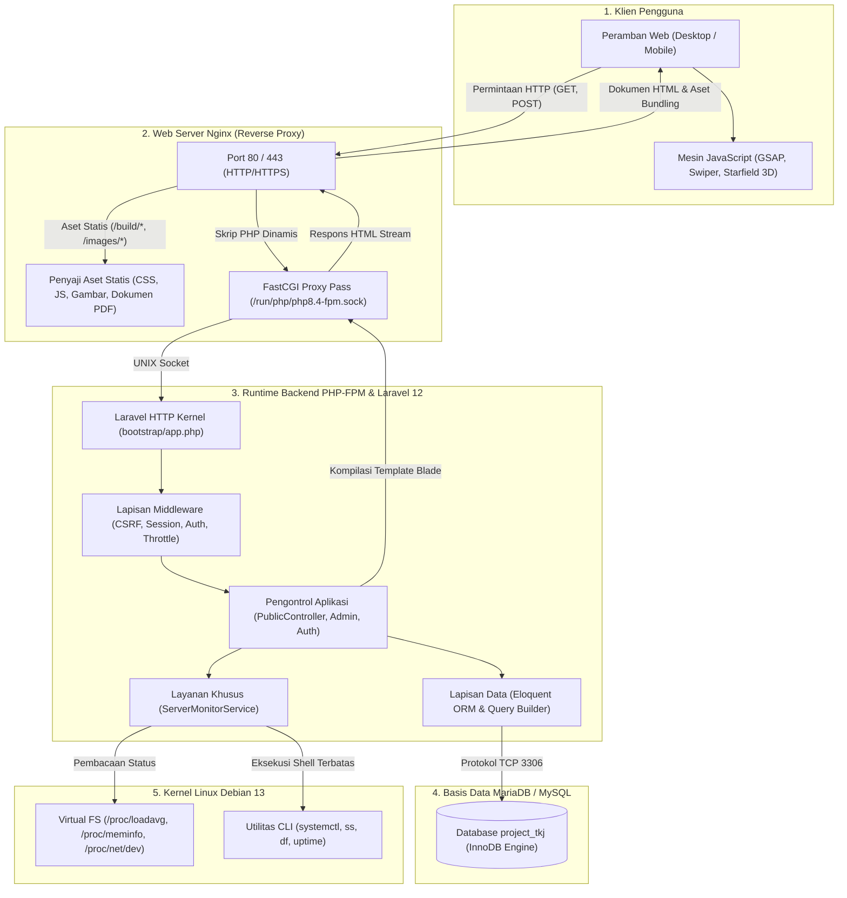
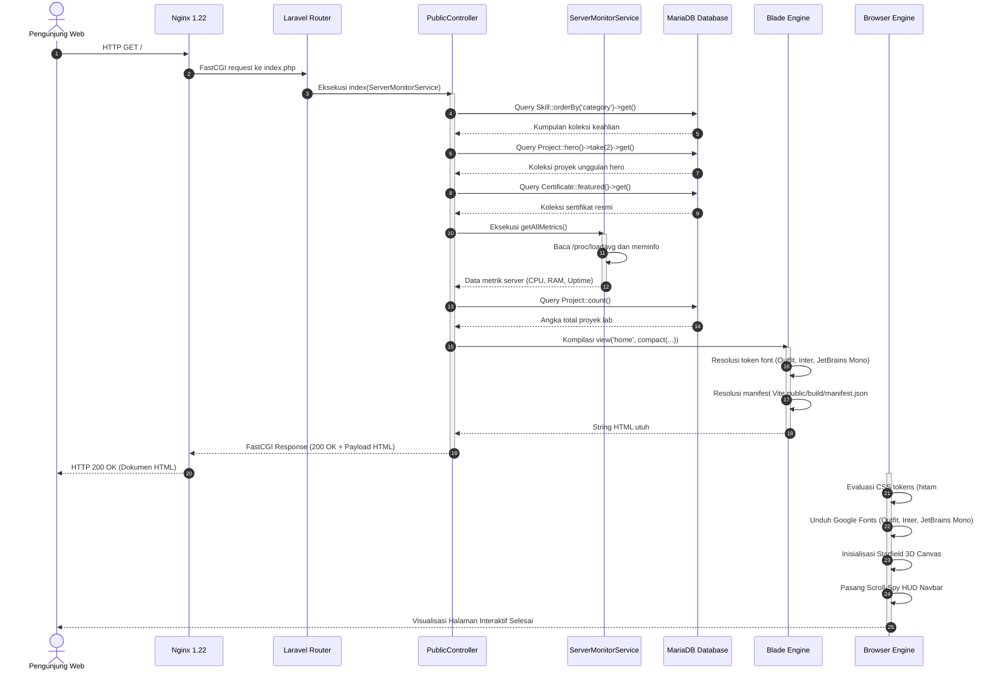
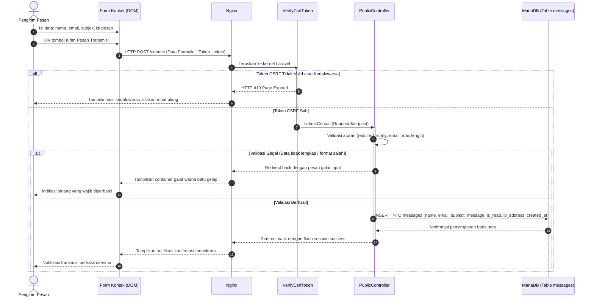
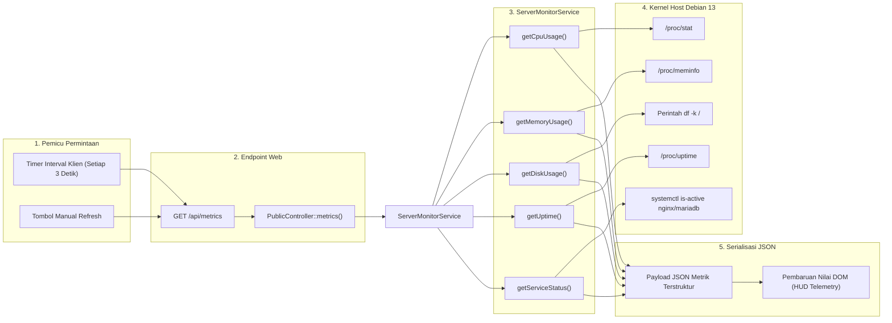
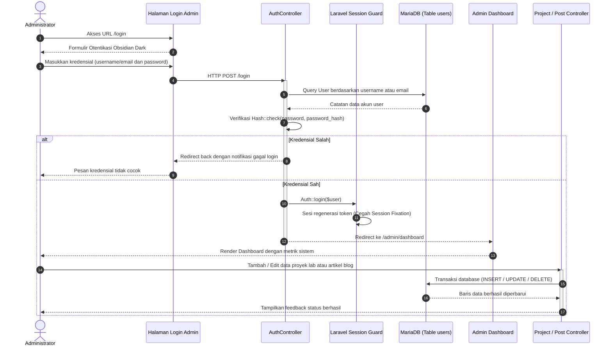
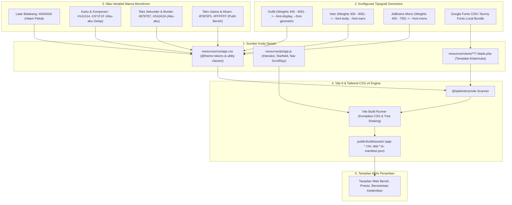
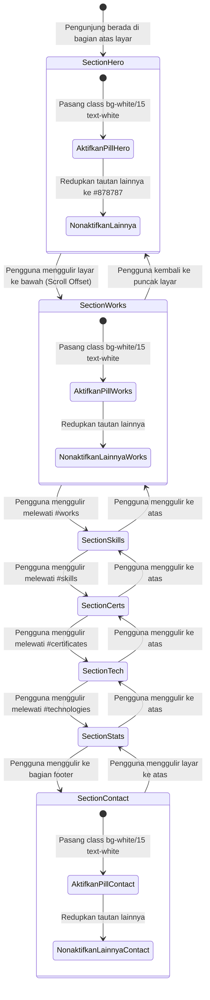
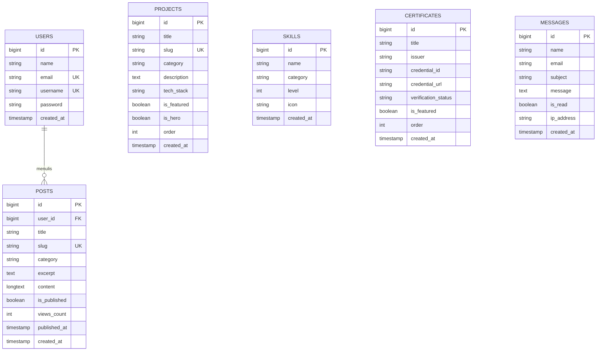

# Preview Workflow dan Arsitektur Web Portofolio TKJ

Dokumen ini dirancang secara khusus untuk visualisasi menggunakan ekstensi VS Code **Markdown Preview Mermaid Support**. Untuk melihat diagram secara interaktif di editor, tekan kombinasi tombol `Ctrl + Shift + V` atau klik kanan pada tab file ini lalu pilih **Open Preview**.

Semua diagram di bawah ini menggunakan sintaks Mermaid standar dan menggambarkan seluruh siklus operasional aplikasi web, mulai dari infrastruktur server hingga rendering antarmuka pengguna.

---

## 1. Topologi Arsitektur LEMP Baremetal

Diagram alir berikut menggambarkan interaksi menyeluruh antara peramban pengunjung, web server Nginx, runtime FastCGI PHP 8.4, aplikasi Laravel 12, dan subsistem Linux Debian 13.

---

## 2. Alur Permintaan Pengunjung Publik (Landing Page)

Diagram sekuensial ini memetakan urutan operasi internal saat pengunjung mengakses rute utama `/` hingga halaman ter-render sempurna dengan gaya monokrom dan tipografi geometris.

---

## 3. Alur Pengiriman Formulir Kontak dan Proteksi Data

Diagram berikut merinci siklus validasi, sanitasi, proteksi serangan CSRF dan spam bot, serta penyimpanan pesan ke database.

---

## 4. Alur Kerja Telemetri Server Linux Real-Time

Diagram berikut menggambarkan cara layanan `ServerMonitorService` membaca metrik langsung dari kernel Linux tanpa dependensi eksternal, lalu menyajikannya ke frontend.

---

## 5. Alur Otentikasi dan Pengelolaan Data Admin Panel

Diagram sekuensial ini merinci alur login administrator, regenerasi sesi keamanan, dan eksekusi operasi CRUD di dashboard admin.

---

## 6. Pipeline Kompilasi Aset, Tipografi, dan Desain Monokrom

Diagram berikut mengilustrasikan bagaimana sistem tipografi baru (`Outfit`, `Inter`, `JetBrains Mono`) dan palet warna monokrom dikompilasi oleh Vite 8 dan Tailwind CSS v4.

---

## 7. Mesin State Navigasi HUD & Dynamic Scroll-Spy

Diagram state berikut memetakan logika JavaScript pada floating HUD navbar dalam mendeteksi section aktif pengunjung.

---

## 8. Relasi Data Entitas Relasional (ERD)

Diagram ERD berikut memetakan struktur tabel database yang menyokong seluruh alur data aplikasi.

---

## Ringkasan Integrasi dan Penggunaan

File visualisasi workflow ini dirancang untuk menjaga transparansi dan kemudahan pemeliharaan kode:
- Setiap alur kerja mematuhi arsitektur bersih tanpa komponen tersembunyi.
- Visualisasi diuji kompatibel dengan ekstensi **Markdown Preview Mermaid Support**.
- Jika Anda memperbarui rute atau struktur controller baru, Anda dapat memperbarui blok Mermaid yang sesuai dalam dokumen ini.
